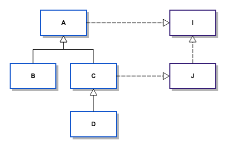

# Lancet

Lancet 是一个轻量级Android AOP框架。

+ 编译速度快, 并且支持增量编译.
+ 简洁的 API, 几行 Java 代码完成注入需求.
+ 没有任何多余代码插入 apk.
+ 支持用于 SDK, 可以在SDK编写注入代码来修改依赖SDK的App.

## 开始使用
### 安装

在根目录的 `build.gradle` 添加:
```groovy
dependencies{
    classpath 'me.ele:lancet-plugin:1.0.2'
}
```
在 app 目录的'build.gradle' 添加：
```groovy
apply plugin: 'me.ele.lancet'

dependencies {
    provided 'me.ele:lancet-base:1.0.2'
}
```


### 示例

Lancet 使用注解来指定代码织入的规则与位置。

首先看看基础API使用:

```java
@Proxy("i")
@TargetClass("android.util.Log")
public static int anyName(String tag, String msg){
    msg = msg + "lancet";
    return (int) Origin.call();
}
```

这里有几个关键点:

* ```@TargetClass``` 指定了将要被织入代码目标类 ```android.util.Log```.
* ```@Proxy``` 指定了将要被织入代码目标方法 ```i```.
* 织入方式为`Proxy`(将在后面介绍).
* ```Origin.call()``` 代表了 ```Log.i()``` 这个目标方法.

所以这个示例Hook方法的作用就是 将代码里出现的所有 ```Log.i(tag,msg)``` 代码替换为```Log.i(tag,msg + "lancet")```

### 代码织入方式

#### @Proxy 
```java
public @interface Proxy {
    String value();
}
```

`@Proxy` 将使用新的方法**替换**代码里存在的原有的目标方法.   
比如代码里有10个地方调用了 `Dog.bark()`, 代理这个方法后，所有的10个地方的代码会变为`_Lancet.xxxx.bark()`. 而在这个新方法中会执行你在Hook方法中所写的代码.  
`@Proxy` 通常用与对系统 API 的劫持。因为虽然我们不能注入代码到系统提供的库之中，但我们可以劫持掉所有调用系统API的地方。  

##### @NameRegex
@NameRegex 用来限制范围操作的作用域. 仅用于`Proxy`模式中, 比如你只想代理掉某一个包名下所有的目标操作. 或者你在代理所有的网络请求时，不想代理掉自己发起的请求. 使用`NameRegex`对 `TargetClass` , `ImplementedInterface` 筛选出的class再进行一次匹配. 


#### @Insert 
``` java
public @interface Insert {
    String value();
    boolean mayCreateSuper() default false;
}
```

`@Insert` 将新代码插入到目标方法原有代码前后。  
`@Insert` 常用于操作App与library的类，并且可以通过`This`操作目标类的私有属性与方法(下文将会介绍)。  
`@Insert` 当目标方法不存在时，还可以使用`mayCreateSuper`参数来创建目标方法。  
比如下面将代码注入每一个Activity的`onStop`生命周期  

```java

@TargetClass(value = "android.support.v7.app.AppCompatActivity", scope = Scope.LEAF)
@Insert(value = "onStop", mayCreateSuper = true)
protected void onStop(){
    System.out.println("hello world");
    Origin.callVoid();
}
```

`Scope` 将在后文介绍，这里的意为目标是 `AppCompatActivity` 的所有最终子类。  
如果一个类 `MyActivity extends AppcompatActivity` 没有重写 `onStop` 会自动创建`onStop`方法，而`Origin`在这里就代表了`super.onStop()`, 最后就是这样的效果：

```java
protected void onStop() {
    System.out.println("hello world");
    super.onStop();
}
```

Note：public/protected/private 修饰符会完全照搬 Hook 方法的修饰符。


### 匹配目标类

```java
public @interface TargetClass {
    String value();

    Scope scope() default Scope.SELF;
}

public @interface ImplementedInterface {

    String[] value();

    Scope scope() default Scope.SELF;
}

public enum Scope {

    SELF,
    DIRECT,
    ALL,
    LEAF
}
```

很多情况，我们不会仅匹配一个类，会有注入某各类所有子类，或者实现某个接口的所有类等需求。所以通过 `TargetClass` , `ImplementedInterface` 2个注解及 `Scope` 进行目标类匹配。

#### @TargetClass
通过类查找.
 1. `@TargetClass` 的 `value` 是一个类的全称.
 2. Scope.SELF 代表仅匹配 `value` 指定的目标类.
 3. Scope.DIRECT 代表匹配 `value` 指定类的直接子类.
 4. Scope.All 代表匹配 `value` 指定类的所有子类.
 5. Scope.LEAF 代表匹配 `value` 指定类的最终子类.众所周知java是单继承，所以继承关系是树形结构，所以这里代表了指定类为顶点的继承树的所有叶子节点.

#### @ImplementedInterface
通过接口查找. 情况比通过类查找稍复杂一些.
1. `@ImplementedInterface` 的 `value` 可以填写多个接口的全名.
2. Scope.SELF : 代表直接实现所有指定接口的类.
3. Scope.DIRECT : 代表直接实现所有指定接口，以及指定接口的子接口的类.
4. Scope.ALL: 代表 `Scope.DIRECT` 指定的所有类及他们的所有子类.
5. Scope.LEAF: 代表 `Scope.ALL` 指定的森林结构中的所有叶节点.

如下图：


当我们使用`@ImplementedInterface(value = "I", scope = ...)`时, 目标类如下:

* Scope.SELF -> A
* Scope.DIRECT -> A C
* Scope.ALL -> A B C D
* Scope.LEAF -> B D


### 匹配目标方法
虽然在 `Proxy` , `Insert` 中我们指定了方法名, 但识别方法必须要更细致的信息. 我们会直接使用 Hook 方法的修饰符，参数类型来匹配方法.  
所以一定要保持 Hook 方法的 `public/protected/private` `static` 信息与目标方法一致，参数类型，返回类型与目标方法一致.  
返回类型可以用 Object 代替.  
方法名不限. 异常声明也不限.  

但有时候我们并没有权限声明目标类. 这时候怎么办？  
##### @ClassOf
可以使用 `ClassOf` 注解来替代对类的直接 import.  
比如下面这个例子：  
```java
public class A {
    protected int execute(B b){
        return b.call();
    }

    private class B {

        int call() {
            return 0;
        }
    }
}

@TargetClass("com.dieyidezui.demo.A")
@Insert("execute")
public int hookExecute(@ClassOf("com.dieyidezui.demo.A$B") Object o) {
    System.out.println(o);
    return (int) Origin.call();
}
```

`ClassOf` 的 value 一定要按照 **`(package_name.)(outer_class_name$)inner_class_name([]...)`**的模板.  
比如:
* java.lang.Object
* java.lang.Integer[][]
* A[]
* A$B

### API
我们可以通过 `Origin` 与 `This` 与目标类进行一些交互.  

#### Origin
`Origin` 用来调用原目标方法. 可以被多次调用.  
`Origin.call()` 用来调用有返回值的方法.  
`Origin.callVoid()` 用来调用没有返回值的方法.  
另外，如果你有捕捉异常的需求.可以使用  
`Origin.call/callThrowOne/callThrowTwo/callThrowThree()`
`Origin.callVoid/callVoidThrowOne/callVoidThrowTwo/callVoidThrowThree()`

For example:

```java
@TargetClass("java.io.InputStream")
@Proxy("read")
public int read(byte[] bytes) throws IOException {
    try {
        return (int) Origin.<IOException>callThrowOne();
    } catch (IOException e) {
        e.printStackTrace();
        throw e;
    }
}
```


#### This
仅用于`Insert` 方式的非静态方法的Hook中.(暂时)  

##### get()
返回目标方法被调用的实例化对象.  

###### putField & getField
你可以直接存取目标类的所有属性，无论是 `protected` or `private`.  
另外，如果这个属性不存在，我们还会自动创建这个属性. Exciting!  
自动装箱拆箱肯定也支持了.  

一些已知的缺陷:  
+ `Proxy` 不能使用 `This`
+ 你不能存取你父类的属性. 当你尝试存取父类属性时，我们还是会创建新的属性.

For example:

```java
package me.ele;
public class Main {
    private int a = 1;

    public void nothing(){

    }

    public int getA(){
        return a;
    }
}

@TargetClass("me.ele.Main")
@Insert("nothing")
public void testThis() {
    Log.e("debug", This.get().getClass().getName());
    This.putField(3, "a");
    Origin.callVoid();
}

```

## Tips
1. 内部类应该命名为  ```package.outer_class$inner_class```  
2. SDK 开发者不需要 `apply` 插件, 只需要 ```provided me.ele:lancet-base:x.y.z```  
3. 尽管我们支持增量编译. 但当我们使用 ```Scope.LEAF、Scope.ALL``` 覆盖的类有变动 或者修改 Hook 类时, 本次编译将会变成全量编译.  

## License

Licensed under the Apache License, Version 2.0 (the "License");
you may not use this file except in compliance with the License.
You may obtain a copy of the License at

   http://www.apache.org/licenses/LICENSE-2.0

Unless required by applicable law or agreed to in writing, software
distributed under the License is distributed on an "AS IS" BASIS,
WITHOUT WARRANTIES OR CONDITIONS OF ANY KIND, either express or implied.
See the License for the specific language governing permissions and
limitations under the License.


